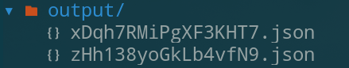
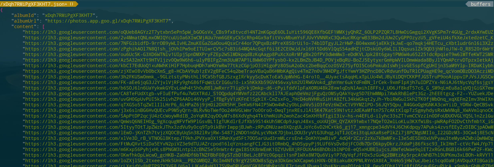

# gpPoacher

This script will fetch all the image urls from a Google Photos album.

## Preview

### Output filestructure

An output folder will be created that contains a JSON file for each album.

### JSON content

Every JSON will have the `albumId`, the `albumUrl` and all the image urls in an array as `content`.

## Requirements:

* [nodejs](https://nodejs.org/)
* A Google Photo album that has a share link.

## Setup

* Clone this repository: `git clone https://github.com/realestninja/gpPoacher.git`
* `npm i` to install the dependencies.

## Usage

* For usage on a single album, just run `node main.js albumid`, for example `node main.js https://photos.app.goo.gl/zHh138yoGkLb4vfN9`.
* For usage on multiple albums, use the `shareUrls.template`. Delete it's placeholder content, then place all the urls in seperate lines inside and rename it to `shareUrls`. Now just run `node main.js`.
